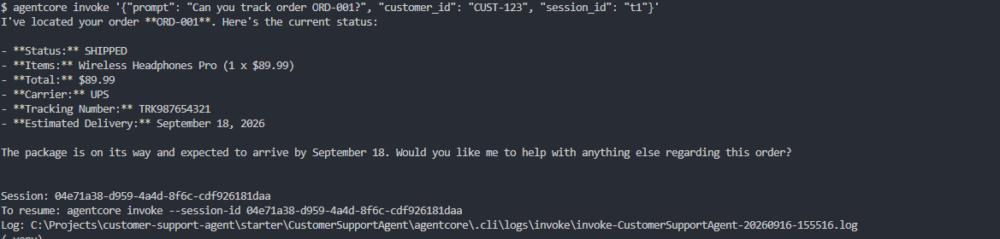
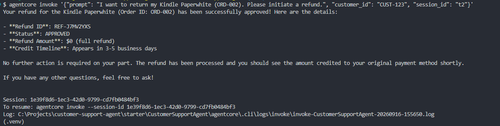
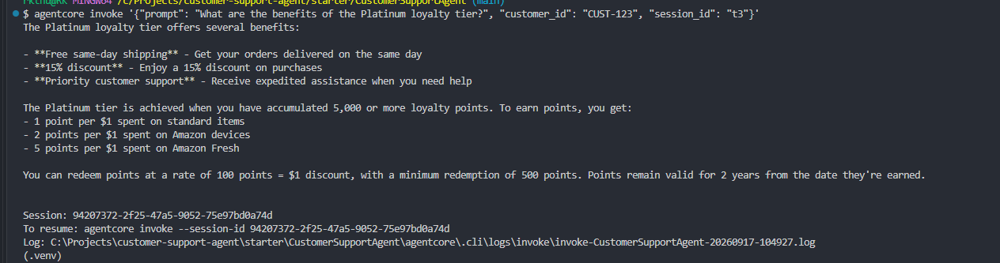
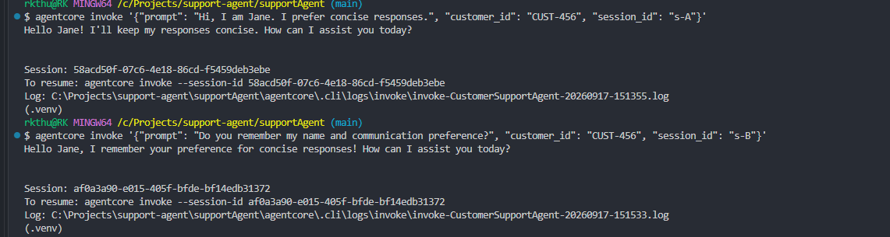
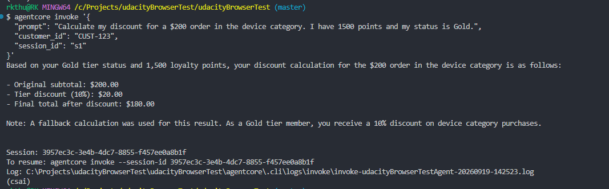
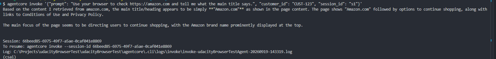

# Customer Support AI Agent

An AI Customer Support Agent built on AWS Bedrock AgentCore, Amazon Bedrock (Nova Lite), and the Strands Agentic Framework. The agent integrates long-term persistent memory, automated loyalty calculations via serverless code execution, dynamic Model Context Protocol (MCP) tool integration, and web scraping capabilities.

## Architecture Overview

```
                          +-------------------------------+
                          |    User / External Client     |
                          +---------------+---------------+
                                          |
                                          v
+-----------------------------------------------------------------------------------+
|                        AWS Bedrock AgentCore Runtime                              |
|                                                                                   |
|   1. Pre-Invocation Context Retrieval                                             |
|      +------------------------------------------------------------------------+   |
|      | Bedrock AgentCore Memory (Fetch semantic history by customer_id)        |   |
|      +------------------------------------------------------------------------+   |
|                                         |                                         |
|                                         v                                         |
|   2. Strands Orchestrator & LLM Core                                              |
|      +------------------------------------------------------------------------+   |
|      | Model: Amazon Nova Lite (global.amazon.nova-2-lite-v1:0)                |   |
|      +------------------------------------------------------------------------+   |
|                                         |                                         |
|   3. Tool Selection & Execution         |                                         |
|      +----------------------------------+-------------------------------------+   |
|      |                                  |                                     |   |
|      v                                  v                                     v   |
|  [Knowledge Base]             [Code Interpreter]                     [MCP Gateway] |
|  Amazon Bedrock KB            Bedrock Code Session                    HTTP Stream  |
|  (Product Catalog / Policies) (Math & Tier Discounts)                      |      |
|                                                                            |      |
|                                                      +---------------------+------+
|                                                      |                            |
|                                                      v                            v
|                                               [API Gateway Target]        [Lambda Target]
|                                               /order-tracker              /refund-processor
|                                                                                   |
|   4. Post-Invocation Hook Execution                                               |
|      +------------------------------------------------------------------------+   |
|      | MemoryHook -> AfterInvocationEvent -> Save turn to AgentCore Memory     |   |
|      +------------------------------------------------------------------------+   |
+-----------------------------------------------------------------------------------+
```

## Key Features

* **Persistent Customer Memory:** Dynamically retrieves historical context using `MemoryClient` prior to invocation and saves interaction turns post-flight using an `AfterInvocationEvent` hook.
* **Serverless Math & Loyalty Engine:** Uses AWS Bedrock Code Interpreter (`code_session`) to calculate point redemptions, tier multipliers, and discount caps in a sandboxed Python execution environment.
* **Dynamic MCP Tool Gateway Integration:** Connects asynchronously over Streamable HTTP to an AWS Bedrock AgentCore Gateway, dynamically discovering and invoking tools hosted on Amazon API Gateway or AWS Lambda.
* **Knowledge Retrieval:** Queries AWS Bedrock Knowledge Bases for catalog, return policies, and warranty details.
* **Web Scraping Capabilities:** Built-in web reader tool and `AgentCoreBrowser` support inspecting external web pages directly.

## Project Screenshots

### 1. Agent Responding to User Queries

  
*Figure 1: Agent executing order tracking*


  
*Figure 2: Agent executing refund initiation*

  
*Figure 3: Agent accessing Knowledge Base to retireve policy details (RAG)*

  
*Figure 4: Agent accessing Long term memory*

  
*Figure 5: Agent calculating using built-in code interpretor tool*

  
*Figure 6: Agent using Agentcore browser for web search*


## Getting Started

### Prerequisites

* Python 3.10+
* `uv` package manager
* Configured AWS CLI credentials with access to Bedrock, AgentCore, and Lambda services (`us-east-1`).
* AWS AgentCore CLI

### Local Setup

1. **Clone repository:**
   ```bash
   git clone https://github.com/your-org/customer-support-agent.git
   cd customer-support-agent
   ```

2. **Install dependencies:**
   ```bash
   uv sync
   ```

3. **AWS AgentCore CLI** (Latest recommended version):
  ```bash
  # Recommended (Global CLI via npm):
  npm install -g @aws/agentcore
  ```

## Usage & Execution

### 1. Local CLI Testing

Run a single test invocation locally using `uv`:
```bash
uv run --active main.py '{"prompt": "What are the benefits of the Platinum loyalty tier?", "customer_id": "CUST-123", "session_id": "s1"}'
```

### 2. Deploy to AWS Bedrock AgentCore

Deploy the agent container into the AgentCore runtime environment:
```bash
agentcore deploy
```

### 3. Invoke Deployed Cloud Agent

Send requests directly to your cloud-hosted agent:
```bash
agentcore invoke '{"prompt": "What are the benefits of the Platinum loyalty tier?", "customer_id": "CUST-123", "session_id": "s1"}'
```
## Environment Variables & Configuration

| Variable / Parameter | Description |
| :--- | :--- |
| `GATEWAY_URL` | AgentCore MCP Gateway Endpoint |
| `KB_ID` | Bedrock Knowledge Base ID |
| `MEMORY_ID` | Bedrock AgentCore Memory Resource ID |
| `MODEL_ID` | Foundation Model ID |
| `REGION` | Target AWS Region |